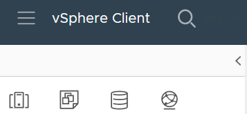
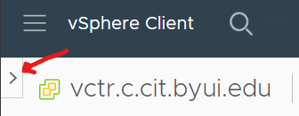
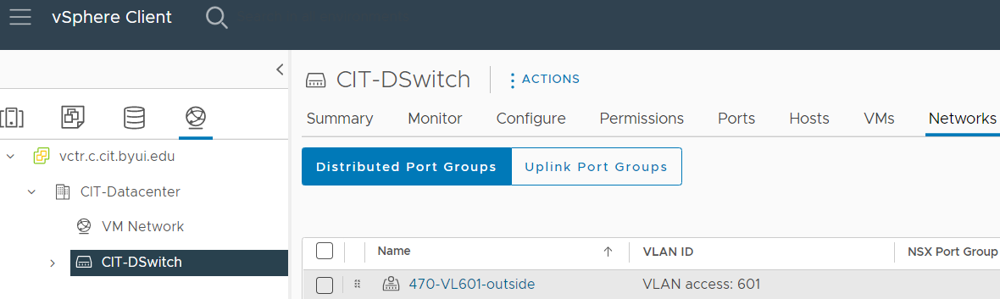

# Systems Security II
## Tools: CIT department VPN and VMware infrastructure

While enrolled in selected courses,
students manage virtual machines in a private OpenShift infrastructure operated by BYU-Idaho's CSE department.
Our infrastructure consists of clusters of enterprise-grade server hardware,
integrated with Redhat products.

As a CYBER 470 student, you will use OpenShift to create and operate virtual servers.

### Required: Use GlobalProtect software to engage a VPN connection ###
VPN connection instructions:
<a
href="https://byui-cit.atlassian.net/wiki/spaces/CDI/pages/16351237/" target="_blank" ref="noopener">How to Install VPN Client for CIT Firewall</a>

### Required: Sign into CSE OpenShift ###
*Note: OpenShift runs on a privately addressed server, so it is only available **after** you successfully engage your VPN conneciton.*

After connecting to the department's VPN service using GlobalProtect, use your BYU-I credentials to log into OpenShift:
<a href="[https://vctr.c.cit.byui.edu/ui/](https://oauth-openshift.apps.byui-cit.c.cit.byui.edu/oauth/authorize?client_id=console&redirect_uri=https%3A%2F%2Fconsole-openshift-console.apps.byui-cit.c.cit.byui.edu%2Fauth%2Fcallback&response_type=code&scope=user%3Afull&state=cf2ac3d1fe1340d1bb0cb0860574f5fd)" target="_blank" ref="noopener">[https://vctr.c.cit.byui.edu/ui/](https://oauth-openshift.apps.byui-cit.c.cit.byui.edu/oauth/authorize?client_id=console&redirect_uri=https%3A%2F%2Fconsole-openshift-console.apps.byui-cit.c.cit.byui.edu%2Fauth%2Fcallback&response_type=code&scope=user%3Afull&state=cf2ac3d1fe1340d1bb0cb0860574f5fd)</a>

## Quick tour of the CSE OpenShift Infrastructure, using the web interface ##

From the 'hamburger' ( ≡ ) menu, select *Inventory*:

The panel you should see on the left side of the web interface has four pictographic icons in its header:
1. Hosts and Clusters
2. VMs and Templates
3. Storage
4. Networks

If you accidentally hide the left panel, click on the angle bracket ( > ) below the hamburger to show it again:

### vSphere: Explore the VMs and Templates web user interface ###
Most of your work will happen under the second icon, VMs and Templates:

Expand the tree-list structure to find the CIT-470-Security folder, and within it, your team's subfolder.
This is where you and your teammates will deploy your virtual servers.
You will also find a Templates subfolder.
This is where you will find a generic server template.

### vSphere: Explore the Newtorks web user interfae ###
Select the fourth icon, Networks.
Then expand the tree-list structure to find and select the distributed virtual switch named **CIT_DSwitch**,
and select the Networks tab:

You should find a table that lists the virtual local area networks (VLANs) assigned to your team, along with their VLAN ID numbers.
Your should use these VLAN access numbers when you record "layer two" VLAN labels on your team's network diagrams.

### vSphere: Explore the Storage web user interface ###
Select the third icon, Storage:

This shows the CIT department's storage-area-network (SAN) resources.

### vSphere: Find a Windows Server installation image file ###
Expand the tree-list structure to find four storage containers, and select the one with **v103** in its name.
Then select the **Files** tab, and select the folder named **!-ISOs** (pronounced *bang-ISOs*).
You will see a collection of installation images for various operating systems.

The Windows edition recommended for CIT 470 students is **Windows Server 2022**. Find its installation image file.

(Its name starts with **en-us_windows_server_2022_updated**.)

With this image, the "generic template" can be modified and used to deploy a Windows Server.
>A Windows Server evaluation license expires after 120 days.
Fortunately, BYU-Idaho semesters are about 100 days long, so you won't need to worry about upgrading the license for this course.
But when you use Windows Server products later on in your career, you or your employer will need to purchase server licenses from Microsoft.
It's probably good for your career to maintain skills for using Windows Servers.

### vSphere: Find Linux installation images files ###
The two Linux distributions we recommend for CIT 470 students are **AlmaLinux OS** version 8 and **Ubuntu Server** version 22.
Browse the collection and find the .iso installers for each of these:

The "generic template" can be used to deploy either of these Linux variants.

- AlmaLinux OS uses Red Hat Packages (.rpm files) for software distribution and `dnf` ("dandified") to manage software packages.
  - If you have experience with Red Hat style distributions,
such as Red Hat Enterprise, Oracle Linux, CentOS, Fedora, Rocky, etc.
then AlmaLinux will feel familiar.
- Unbuntu Server uses Debian packages (.deb files) for software distribution and `apt` ("advanced package toolkit") for software package management.
  - If you have experience with Debian style distributions,
such as Debian, Kali, Ubuntu, Raspberry Pi OS, Devuan, etc.
then Ubuntu Server will feel familiar.

>Your team doesn't need to use both variants, but it's probably good for your career to maintain skills using both of the popular Linux software package formats.
The *SELinux* (security enhanced Linux) activities in this course are designed for an AlmaLinux OS web server,
so it might be helpful for your team to deploy at least one AlmaLinux server as a DMZ endpoint.
